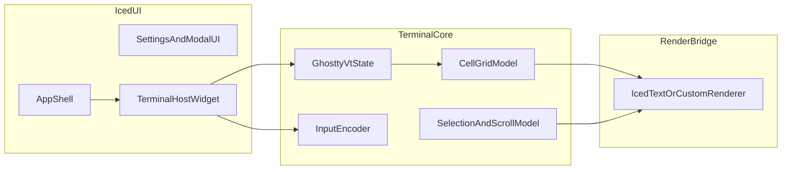

# iced 能力边界与终端重构指南

本文档用于明确：在 RustSsh 终端 2.0 里，哪些能力应优先复用 `iced`，哪些能力必须继续由 `libghostty` 与终端核心层掌控。目标是降低重构分歧，形成可执行的工程边界。

最后同步：2026-04-01  
实现优先级说明：如文档与代码不一致，以 `src/iced_app/terminal_viewport.rs`、`src/iced_app/update.rs`、`src/terminal_core.rs` 为准。

---

## 目录

- [1. 结论（先看）](#1-结论先看)
- [2. 适合优先使用 iced 的能力](#2-适合优先使用-iced-的能力)
- [3. 必须保留在终端核心（libghostty + terminal core）的能力](#3-必须保留在终端核心libghostty--terminal-core的能力)
- [4. 目标架构（建议）](#4-目标架构建议)
- [5. 单一事实来源（SSOT）](#5-单一事实来源ssot)
- [5.1 Iced 文本布局与网格命中（实践约束）](#51-iced-文本布局与网格命中实践约束)
- [6. 与当前实现的差距（用于排期）](#6-与当前实现的差距用于排期)
- [7. 推荐分阶段改造路线](#7-推荐分阶段改造路线)
- [8. 验收标准（DoD）](#8-验收标准dod)
- [9. 工程约束（防止后续跑偏）](#9-工程约束防止后续跑偏)
- [10. 非目标（当前版本）](#10-非目标当前版本)
- [11. 交付清单模板（每个任务必须包含）](#11-交付清单模板每个任务必须包含)

---

## 1. 结论（先看）

- 推荐策略：**UI 与通用文本能力 iced 化；终端语义与协议能力 libghostty 化**。
- 不推荐策略：把终端完整语义（cell/grid、模式协议、滚屏语义）完全下放给 iced 文本栈。
- 核心原则：`layout by grid, render by glyph`。其中 grid/语义来自终端核心，glyph 渲染可借助 iced 能力。

---

## 2. 适合优先使用 iced 的能力

以下能力应作为后续重构的“优先复用清单”：

| 能力域 | 推荐使用 iced 的点 | 好处 |
|---|---|---|
| 应用壳层 | 窗口生命周期、布局容器、主题机制、页面导航 | 统一 UI 结构，降低维护成本 |
| 通用文本 | 字体加载、字体回退、常规文本缓存与排版 | 中英混排稳定性提升，减少自维护字体逻辑 |
| 输入框与表单 | 文本输入、IME、焦点切换、校验交互 | 平台一致性更好，减少边缘输入 bug |
| 事件系统 | `subscription` / `task` / `event` 驱动 | 状态流清晰，替代散落的手工轮询 |
| 跨平台后端 | 渲染后端切换与运行时封装 | 降低平台适配成本 |
| 通用组件 | 弹窗、设置页、列表、状态栏、通知 | 组件复用高，开发效率提升 |

> IME 边界说明：上表中的 IME 优势主要针对壳层表单输入。终端区（PTY 输入）中的预编辑、提交、编码语义仍应通过 terminal core / libghostty 路径统一处理。

---

## 3. 必须保留在终端核心（libghostty + terminal core）的能力

以下能力不应交给 iced 通用文本体系：

| 能力域 | 归属 | 原因 |
|---|---|---|
| VT 状态机与 ANSI/DEC 语义 | `libghostty` | 终端协议复杂且需高一致性 |
| 屏幕缓冲（权威状态） | `libghostty` | 避免双份 buffer 导致语义漂移 |
| Cell 网格模型（最小派生） | terminal core | 终端不是普通段落排版 |
| 光标语义（block/bar/underline/blink） | terminal core | 依赖模式与帧节奏 |
| 宽字符/组合字符占格 | terminal core | 依赖终端列宽语义而非排版引擎 |
| alt-screen / scrollback 规则 | `libghostty` + core | 与 shell/TUI 行为强相关 |
| bracketed paste / focus / key encode | `libghostty` | 需模式感知和协议正确性 |
| 终端选择复制语义 | terminal core | 以行列坐标而非布局盒模型为主 |

边界原则：

- VT 解析与屏幕缓冲的权威在 `libghostty`。
- terminal core 仅持有 UI 必需的最小派生状态（选择、滚动视图、同步锚点、缓存指针等）。
- 禁止在 UI 层维护第二份“终端真值状态”。

---

## 4. 目标架构（建议）

说明：

- `iced` 负责壳层与组件，不负责终端协议语义。
- `TerminalHostWidget` 是桥接点：接收 iced 事件，调用 core 编码，驱动渲染。
- 渲染层允许两种实现：
  - `IcedTextRenderer`（先实现，快）
  - `CustomTerminalRenderer`（后续提升视觉与性能）

### 4.1 libghostty 对接面（薄封装层）

- 统一入口：键盘/鼠标/焦点/粘贴事件先映射为内部 `TerminalEvent`，再下发到封装层。
- 统一输出：读屏数据（plain/styled/snapshot）仅经封装层暴露。
- 统一脏标记：重绘触发由 dirty 状态驱动，不在 UI 层猜测。
- 升级策略：`libghostty` 版本 bump 的适配应集中在封装层，业务层禁止散落 FFI 常量依赖。
- 变更来源：具体 API 变动以官方发布说明为准。

---

## 5. 单一事实来源（SSOT）

终端尺寸链路必须只有一个推导源，禁止多处重复计算：

`window_px -> viewport_px -> font_metrics -> cols/rows -> PTY winsize(channel.window_change)`

职责约束：

- 像素与网格换算：由 `terminal_viewport` 统一实现。
- 触发时机：由 `update` 层统一订阅窗口变化与连接后首次同步。
- 下游写口：仅允许通过 `TerminalController::resize_and_sync_pty` 写 PTY。
- 多标签模型：由 `single_shared_session` 决定同步策略：
  - `true`：仅 active tab 同步（切 tab 会断开旧会话，避免标题/PTY 错位）。
  - `false`：窗口变化会遍历所有活动会话同步 winsize；切回时也会对 active tab 再同步一次。

禁止项：

- 在 `view` 层、组件层、业务模块各自推导 cols/rows。
- 绕过 controller 直接调用 `session.resize_pty`。

### 5.1 Iced 文本布局与网格命中（实践约束）

鼠标列测试使用 `terminal_viewport` 推导的列带宽度（`w_map` 均分 `cols`，即 `cell_w`，见 `terminal_scroll_cell_geometry`）。**渲染必须与该列带同源**，否则会出现「越往右列号越偏」的累积误差：

- **纵向**：`rich_text` / 段落默认行盒高度可能大于 PTY 的 `ch`；须用固定行高（如 `terminal_rich` 中 `fixed_terminal_row`，高度取 `term_cell_h()`），与 `floor(local_y / ch)` 一致。
- **横向**：仅靠「整行一条 `rich_text`、多 `span` 串联」时，水平方向会按真实字宽累加，与 **等分列带** 不一致；须用 **每格 `container`/`Fixed(cell_w)`**（`cell_w` 与 `terminal_scroll_cell_geometry` 一致）拼成一行（如 `Row`），使第 `k` 列的像素左缘与 `local_x / cell_w` 对齐。
- **片段级 shaping**：同一终端格内避免把多格合并成单串再 shaping（`terminal_core::build_row_fragments` / `terminal_rich` 按格输出），减少字簇宽度与网格错位。

完整现象、排查顺序与涉及文件清单：[`doc/终端网格命中测试排查复盘.md`](终端网格命中测试排查复盘.md)。

---

## 6. 与当前实现的差距（用于排期）

当前项目里，iced 侧已具备基础连接与键盘输入，但仍存在这些差距：

- 终端显示仍偏 plain/styled 混合过渡态，宽字符与光标边界仍需收敛。
- 终端 resize 与 PTY/cols/rows 联动在多场景（设置变更、tab 切换）需继续收敛。
- focus/paste 协议能力需与 libghostty 路径完全对齐。
- 键盘编码仍有 fallback 路径，需继续压缩到受控白名单。

---

## 7. 推荐分阶段改造路线

### 阶段 A（P0：协议与正确性）

- 统一 key/focus/paste 到 libghostty 编码路径；
- 完成 terminal 区域尺寸到 cols/rows 的实时映射；
- 建立键盘回归矩阵（vim/tmux/top）。

### 阶段 B（P1：显示与交互）

- iced 终端区升级为 styled 渲染（颜色/粗体/下划线/光标）；
- 完成选择复制、滚动与状态栏联动；
- 补齐设置项生效链路（字体、行高、滚动缓冲、输入策略）。

#### P1 渲染下限约定（必须满足）

- 主网格保持等宽语义，禁止用段落自动换行替代 grid。
- dirty 粒度至少到“行”（推荐 run 级），禁止以全屏重建作为常态路径。
- 光标定位按列坐标，不按字符串字节/字符索引。
- 宽字符续位 cell 不得产生可见占位空格。

### 阶段 C（P2：性能与体验）

- 评估并引入自定义终端渲染器（必要时复用现有 grid/atlas/pipeline 思路）；
- 完成性能基线：空闲 CPU、首帧、高输出吞吐、长跑内存；
- 形成跨平台扩展预案（Linux/Windows）。

---

## 8. 验收标准（DoD）

- 功能正确性：
  - SSH 连接、命令执行、滚动、复制粘贴、焦点切换可用；
  - `vim/tmux/top` 键位行为正确；
  - 中英文混排与宽字符列对齐稳定。
- 渲染一致性：
  - 无明显基线抖动、横向压缩、字符虚化回归；
  - 终端主场景视觉不劣于当前基线。
- 资源与性能：
  - 空闲与高输出场景下响应稳定；
  - 长时间运行无明显内存线性爬升。
- 回归可执行性：
  - PR 最小回归集可自动执行；
  - nightly 具备性能与长稳采集结果；
  - 失败时有可追溯产物（日志/指标/截图或录屏）。

---

## 9. 工程约束（防止后续跑偏）

- 不在 UI 层直接实现 VT 协议分支逻辑。
- 不让普通文本排版规则决定终端列宽语义。
- 终端区鼠标列映射与 Iced 渲染列宽必须同源（以 `terminal_viewport` 的 `cell_w` 为准，禁止在 `view`/组件层另起一套列宽推导）。
- 终端关键行为必须可回归（脚本 + 日志指标）。
- 保持桥接层可替换：`TerminalHostWidget` 与 core 解耦。
- 模态打开时，终端区键盘与粘贴默认不进入 PTY（除非明确放行并记录策略）。
- focus 上报与粘贴策略需与终端实际焦点状态一致，不允许 UI 焦点与协议上报脱钩。

---

## 10. 非目标（当前版本）

当前阶段不作为硬性承诺：

- 完整无障碍能力（屏幕阅读器深度适配等）。
- 系统级大字号/辅助缩放下的全面视觉一致性保证。
- 全平台（Linux/Windows/macOS）字体渲染完全一致。
- 录屏级视觉回归系统（可先用日志+截图过渡）。

---

## 11. 交付清单模板（每个任务必须包含）

- 目标与范围（影响模块、风险点）
- 改造文件列表
- 回退开关（若引入新渲染路径）
- 验收命令与场景
- 前后对比数据（至少一组）

