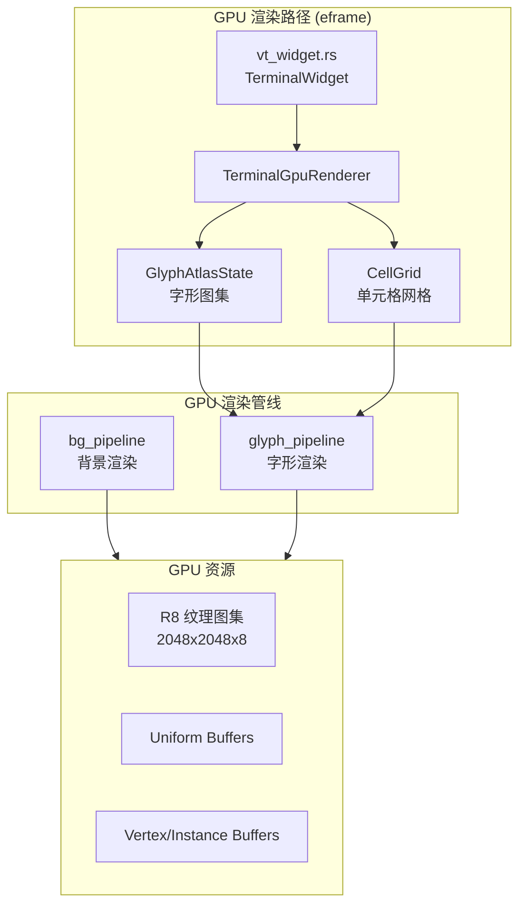

# GPU 终端渲染实现文档

> **状态**: 已废弃 — 此代码将于近期删除
> **删除原因**: 未与 iced 框架集成，依赖声明缺失，维护成本高

---

## 概述

GPU 渲染模块是项目中一个**独立的实验性路径**，用于将终端文本渲染从 CPU 切换到 GPU 加速。

该路径与主应用（iced 框架）平行，未被实际使用，代码保留但依赖未声明。

---

## 架构设计



---

## 核心组件

### 1. 字形图集 (GlyphAtlasState)

**位置**: `src/terminal/glyph_atlas.rs`

**功能**:
- 动态 R8 图集，用于存储 GPU 字形光栅化结果
- 2048x2048 像素，单槽 64x64 像素，最多 8 页
- 基于 `ab_glyph` 库进行 CPU 端字形光栅化

**关键设计**:
```rust
// LRU 缓存策略
struct GlyphAtlasState {
    char_to_slot: HashMap<u32, u16>,      // 字符 → 槽位映射
    slot_to_char: HashMap<u16, u32>,      // 槽位 → 字符映射
    slot_last_used_tick: HashMap<u16, u64>, // LRU 时间戳
    pixels: Vec<u8>,                       // 图集像素数据 (R8)
}
```

**光栅化流程**:
1. 请求字符字形 → 查询 `char_to_slot`
2. 缓存命中 → 返回槽位
3. 缓存未命中 → 调用 `allocate_slot_for_char`
   - 优先当前页分配
   - 页满时分配新页
   - 全部满时 LRU 淘汰
4. 调用 `ab_glyph` 光栅化字形
5. 绘制到图集像素缓冲区
6. 上传到 GPU 纹理（`wgpu::Queue::write_texture`）

---

### 2. 单元格网格 (CellGrid)

**位置**: `src/terminal/gpu_renderer/grid.rs`

**功能**:
- 将 `VtStyledRow`（libghostty 样式行）转换为 GPU 实例数据
- 处理 Unicode 字素分组和宽度计算
- 标记复杂字素（组合字符、Emoji）以触发 CPU 回退

**数据结构**:
```rust
struct Cell {
    ch: u32,        // Unicode 标量值
    fg: [u8; 4],    // 前景色 RGBA
    bg: [u8; 4],    // 背景色 RGBA
    flags: u8,      // 位标志: bit0=有背景, bit1=粗体, bit2=下划线, bit3=暗色, bit4=删除线
}
```

---

### 3. GPU 渲染器 (TerminalGpuRenderer)

**位置**: `src/terminal/gpu_renderer.rs`

**功能**:
- 管理离屏纹理 (`OffscreenTarget`)
- 构建 GPU 实例数据 (`BgInstance`, `GlyphInstance`)
- 与 eframe/egui 集成

**关键接口**:
```rust
pub struct TerminalGpuRenderer {
    pub texture_id: Option<eframe::egui::TextureId>,  // 注册到 egui 的纹理 ID
    offscreen: Option<OffscreenTarget>,               // 离屏渲染目标
    glyph_atlas: GlyphAtlasShared,                   // 字形图集
    grid: CellGrid,                                  // 单元格网格
}
```

---

### 4. GPU 渲染管线

#### 4.1 背景渲染 (bg_pipeline.rs)

**功能**: 实例化渲染单元格背景色

**Vertex Shader 逻辑**:
```wgsl
// 输入: quad_pos (0-1), cell_xy, bg_rgba
// 输出: NDC 坐标 + 颜色
let px = u.origin_px + cell * u.cell_size_px + v.quad_pos * u.cell_size_px;
let ndc_x = (px.x / u.viewport_px.x) * 2.0 - 1.0;
```

#### 4.2 字形渲染 (glyph_pipeline.rs)

**���能**: 实例化渲染终端字形

**Vertex Shader 关键逻辑**:
```wgsl
// 从 slot ID 计算 atlas UV 坐标
let tile = select(0u, gid - 1u, gid > 0u);
let page = tile / slots_per_page;
let in_page = tile - page * slots_per_page;
let uv0 = vec2<f32>(in_page % atlas_cols, in_page / atlas_cols) * slot_size / atlas_size;
```

**Fragment Shader 特性**:
- 字形采样 + alpha 增强 (`pow(a, 0.85)`)
- 粗体效果: 膨胀采样
- 下划线: `qy > 0.88` 时 alpha = 1.0
- 删除线: `0.50 < qy < 0.60` 时 alpha = 1.0
- 暗色效果: alpha * 0.65

---

### 5. GPU 回调 (callback.rs)

**位置**: `src/terminal/gpu_renderer/callback.rs`

**功能**: 实现 `egui_wgpu::CallbackTrait`，在 eframe 渲染循环中插入 GPU 渲染

**渲染流程**:
1. `prepare()`: 
   - 上传脏槽字形到 GPU 纹理
   - 写入 uniform buffer (视口、单元格尺寸)
   - 写入 instance buffer (背景实例、字形实例)
   - 执行 `begin_render_pass` 渲染到离屏纹理
2. `paint()`: 空操作（已在 prepare 完成渲染）

---

## 顶点格式设计

### BgInstance (背景实例)
| 偏移 | 类型 | 字段 |
|------|------|------|
| 0 | Uint16x2 | cell_xy |
| 4 | Uint16x2 | _pad0 |
| 8 | Unorm8x4 | bg_rgba |
| 12 | Uint8[12] | _pad1 |

### GlyphInstance (字形实例)
| 偏移 | 类型 | 字段 |
|------|------|------|
| 0 | Uint16x2 | cell_xy |
| 4 | Uint16 | glyph_slot |
| 6 | Uint16 | atlas_page |
| 8 | Uint16 | flags |
| 10 | Uint16 | _pad0 |
| 12 | Unorm8x4 | fg_rgba |
| 16 | Uint16x4 | uv_rect (u0,v0,u1,v1) |
| 24 | Uint16x4 | dst_rect |
| 32 | Uint8[4] | _pad |

---

## GPU/CPU 回退策略

```rust
fn should_use_gpu_terminal_text(has_wgpu, has_gpu_texture, gpu_env_enabled, atlas_viable) -> bool {
    has_wgpu && has_gpu_texture && gpu_env_enabled && atlas_viable
}
```

**触发 CPU 回退的条件**:
1. wgpu 上下文不可用
2. 离屏纹理未创建
3. GPU 环境变量强制关闭 (`RUST_SSH_TERMINAL_GPU=0`)
4. 字形图集不可用（字体加载失败、ASCII 探测失败）
5. 单元格包含复杂字素（组合字符、多码点 Emoji）

---

## 环境变量

| 变量 | 默认值 | 说明 |
|------|--------|------|
| `RUST_SSH_TERMINAL_GPU` | "1" | 强制 GPU 路径开关 |
| `RUST_SSH_TERM_DUMP_COMPARE` | "0" | CPU/GPU 对比调试 |
| `RUST_SSH_TERM_DUMP_OFFSCREEN` | "0" | 离屏纹理调试 |
| `RUST_SSH_TERM_DUMP_ATLAS` | "0" | 字形图集调试 |
| `RUST_SSH_OFFSCREEN_FILTER` | "linear" | 纹理过滤模式 |
| `RUST_SSH_GPU_GLYPH_NEAREST` | "1" | 强制 Nearest 过滤 |
| `RUST_SSH_GPU_GLYPH_UV_CROP` | "0.0" | UV 裁剪比例 |
| `RUST_SSH_GPU_GLYPH_ALPHA_BOOST` | "1.25" | Alpha 增强系数 |
| `RUST_SSH_GLYPH_TIGHT_RECT` | "0" | 紧凑字形边界 |
| `RUST_SSH_GLYPH_FIT_SCALE` | "0" | 自适应缩放 |

---

## 与 iced 框架的差异

| 方面 | GPU 路径 (eframe) | iced 路径 |
|------|-------------------|----------|
| **框架** | eframe + egui | iced |
| **字体系统** | ab_glyph 直接操作 | iced::font 抽象层 |
| **GPU 访问** | 直接使用 egui_wgpu::wgpu | iced 内部封装 |
| **文本布局** | 自定义 Galley 计算 | iced widget tree |
| **渲染目标** | 离屏纹理 + EguiImage | iced Element |

---

## 删除范围

| 模块 | 文件数 | 说明 |
|------|--------|------|
| gpu_renderer | 5 | GPU 渲染管线 |
| glyph_atlas | 3 | 字形图集 |
| vt_widget.rs | 1 | eframe 终端组件 |
| compare_dump.rs | 1 | GPU/CPU 对比工具 |
| **总计** | **~3400 行** | |

---

## 备注

此文档仅供代码理解和存档目的。该 GPU 渲染路径：

1. **未被主应用使用** — iced 路径使用 `terminal_widget.rs`
2. **依赖声明缺失** — `egui_wgpu` 和 `eframe` 未在 `Cargo.toml` 中声明
3. **架构不兼容** — 无法直接迁移到 iced 框架

如需 GPU 加速，建议在 iced 框架内通过 widget 优化实现，而非独立维护渲染管线。
