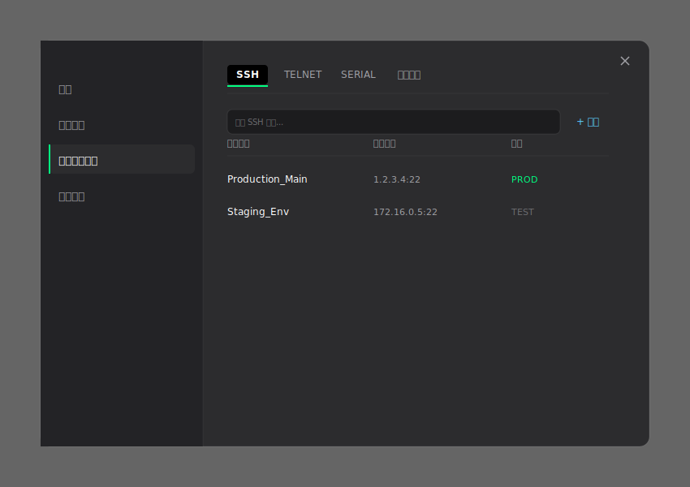

# 设置中心：多协议连接信息管理

## 1. 结构重构
为了支持后续扩展（如串口、Telnet 等），设置中心的“连接信息管理”节点采用 **多页签 (Multi-protocol Tabs)** 形式。该节点在侧边栏中作为一个整体出现。

## 2. 页面原型 (Mockups)

### 2.1 多协议视图 (SSH Tab)
展示了如何在同一管理界面下通过页签切换不同协议的连接列表。

---

## 3. 页签定义
- **SSH**：管理所有已保存的 SSH 会话及其凭据。
- **TELNET**：管理 Telnet 协议连接（含字符编码设置）。
- **SERIAL**：管理串口调试连接（含波特率、流控配置）。
- **高级设置**：全局连接库管理（如导入/导出、备份、默认协议设置）。

---

## 4. 搜索与排序
* 搜索框功能：支持在当前选中的协议标签内进行即时模糊搜索。
* 分组标签：支持跨协议的分组管理（如 PROD 标签可同时应用于 SSH 和 Telnet）。

> [!TIP]
> 这种多页签设计既保留了极简风格，又通过纵向空间换取了极佳的可扩展性。
