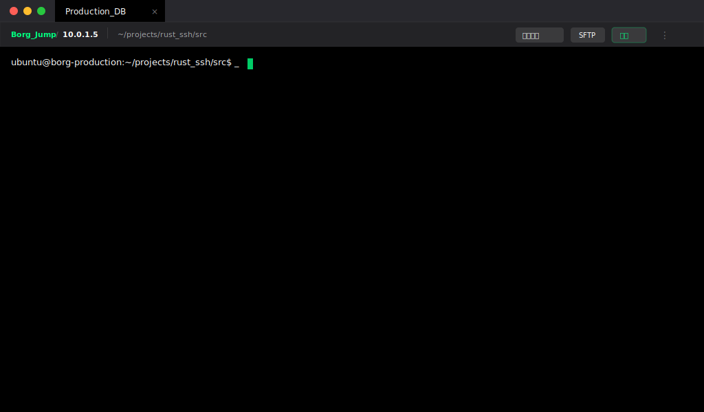

# 终端信息栏：Breadcrumb Bar 设计规范

## 1. 区域定义
**Breadcrumb Bar** 是位于主界面顶栏正下方、终端区域上方的一个信息展示与快捷操作区。

- **命名**：Breadcrumb Bar（面包屑导航栏 / 路径信息栏）
- **高度**：36px
- **背景**：`Bg_Secondary` (#232326)
- **边框**：底部 1px `Border_Subtle`

## 2. 核心功能 (UI 原型)

### 2.1 会话路径 (IP Path)
- **逻辑**：展示当前的连接路径。如果存在跳板机嵌套，以 `/` 分隔。
- **示例**：`Borg_Jump / 10.0.1.5`
- **配置**：支持用户在设置中选择显示“主机地址 (IP)”或“自定义会话名称”。

### 2.2 目录显示 (CWD)
- **功能**：由终端引擎实时上报当前工作目录（通过 OSC 633 或 7 转义序列捕获）。
- **样式**：采用 `JetBrains Mono` 字体，颜色为 `Text_Secondary`。

### 2.3 快捷按钮组 (Right Actions)
- **重新连接**：快速重连当前断连的会话。
- **SFTP**：点击唤起内置临时文件传输小窗口或独立标签页。
- **端口**：显示并管理本地/远程端口转发状态。

---

## 3. 响应式与状态
* **路径过长**：当连接层级过多或目录过深时，路径通过省略号 (`...`) 进行截断。
* **连接中断**：路径颜色变为 `Text_Disabled` (灰色)，并高亮“重新连接”按钮。

> [!TIP]
> 此区域的引入极大增强了多级跳板机场景下的方位感，同时将高频操作从右键菜单中解放出来。
