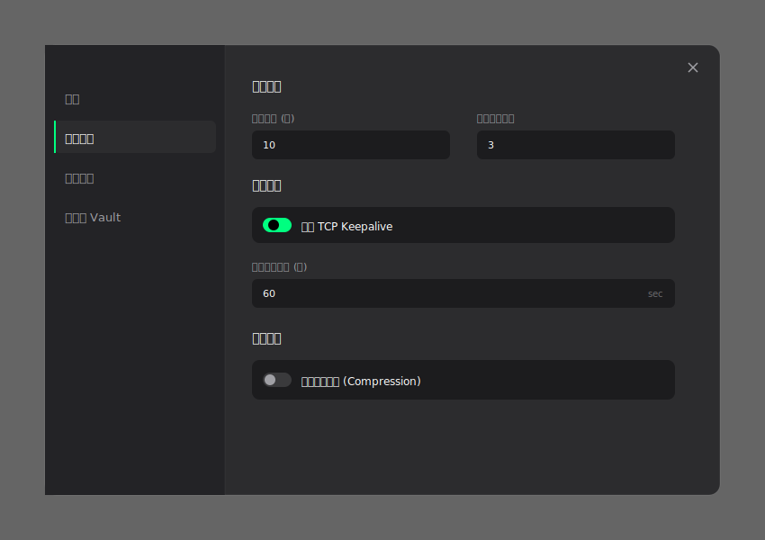

# 设置中心：连接管理功能设计

## 1. 布局整合
按照“设置中心”的左右分栏规格，在左侧导航栏中新增 **“连接管理 (Connection)”** 模块。

## 2. 功能模块 (UI 原型)
新模块将包含以下核心配置项：
- **连接策略**：设置连接超时时间（默认 10s）和自动重连尝试次数。
- **心跳保活**：支持启用 TCP Keepalive，并允许用户自定义发送间隔。
- **性能优化**：提供传输压缩 (Compression) 开关。

---

## 3. 详细字段说明 (Refined Specs)
| 字段 | 默认值 | 校验逻辑 |
| :--- | :--- | :--- |
| **连接超时** | 10s | 1 - 300s |
| **重连次数** | 3次 | 0 - 10次 |
| **保活间隔** | 60s | 30 - 3600s |
| **传输压缩** | 关闭 | 布尔开关 |

> [!NOTE]
> 此模块的视觉风格严格遵循 `Bg_Primary` 主体色与 `Surface_1` 控件背景色的搭配。
