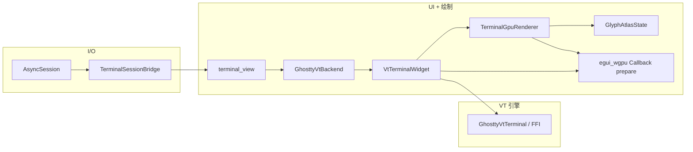

# 终端模块开发指南

本文档描述 `src/terminal` 及相关后端（`libghostty-vt` FFI）的职责边界、一帧内的数据流，以及后续扩展时建议的切入点。面向维护终端渲染、性能与多后端演进的开发者。

---

## 1. 源码目录与职责

| 路径 | 可见性 | 职责 |
|------|--------|------|
| `src/terminal/mod.rs` | `pub` | 终端抽象边界：`TerminalEngine` / `TerminalRenderer` trait、`TerminalSize` 等类型；子模块导出。 |
| `src/terminal/backend.rs` | `pub` | UI 与终端的适配：`TerminalBackend`（输入/输出/绘制）；`GhosttyVtBackend` 包装 `VtTerminalWidget`。 |
| `src/terminal/vt_widget.rs` | `ghostty-vt` | egui 侧 VT 部件：快照脏行、选区/光标、`paint_terminal` 编排 CPU/GPU 路径。 |
| `src/terminal/gpu_renderer.rs` | `pub` | WGPU 离屏渲染：背景 instance、字形 instance、`TerminalOffscreenClearCallback`、与 egui 纹理对接。 |
| `src/terminal/glyph_atlas.rs` | `mod`（crate 内） | TTF/TTC 动态栅格化 atlas（`ab_glyph`）、槽位上传、字体加载路径。 |
| `src/terminal/session_bridge.rs` | `pub` | SSH 字节流按帧预算 drain，避免单帧阻塞 UI。 |
| `src/backend/ghostty_vt.rs` | `pub` | `GhosttyVtTerminal`：FFI、styled row 快照、`VtStyledRun` / `VtStyledRow`。 |
| `src/ui/components/terminal_view.rs` | UI | 终端区域布局、会话桥接、`VtTerminalWidget` 的调用入口（含 OSC cwd 等）。 |

当前默认功能集启用 **`ghostty-vt`**（见根目录 `Cargo.toml`）。`vt_widget` 仅在具备该 feature 时编译。

---

## 2. 架构总览

要点：

- **状态真源**：网格与样式在 libghostty-vt（C）内；Rust 通过 `update_dirty_styled_rows_*` / 快照 API 拉取 **脏行** 级别的 `VtStyledRow`。
- **绘制双路径**：存在 WGPU 且离屏纹理就绪时，正文由 **GPU 纹理** 呈现；否则回退 **egui galley**（`row_paint_cache`）。选区与光标始终在 egui 层叠加。
- **异步与预算**：`TerminalSessionBridge` 限制每帧读取字节数与次数，避免长会话爆量输出卡住 UI。

---

## 3. 一帧内推荐理解顺序（`paint_terminal`）

以下逻辑在 `VtTerminalWidget::paint_terminal` 中串联，便于排查「谁覆盖了谁」「数据是否滞后一帧」等问题。

1. **WGPU**：`ensure_texture`、注册 `TerminalOffscreenClearCallback`、`Shape::image` 使用上一帧末已写入的纹理（同帧内 `prepare` 会在 UI pass 之后执行，详见 egui-wgpu 生命周期）。
2. **渲染状态**：按需 `update_render_state()`。
3. **交互**：选区、滚轮、`alt_screen` 等。
4. **快照**：根据 `dirty()` 仅更新脏行到 `cached_rows`，并记录 `updated_rows_tmp`。
5. **背景条**：GPU 路径下不画整块 CPU 背景矩形，以免盖住纹理。
6. **选区**：叠在终端纹理之上（GPU 路径下选区在「位图正文」之上）。
7. **栅格与实例**：`gpu.update_cells_from_rows` → `build_bg_instances` / `build_glyph_instances`（在 atlas 中为字符分配槽位并栅格化）。
8. **CPU 正文**：仅当 **非** `gpu_terminal_text` 时走 `text_runs` + galley。
9. **光标**：仍走 egui painter。

`gpu_terminal_text` 条件（逻辑见源码）：存在 `wgpu_render_state`、已有 `texture_id`，且环境变量 **`RUST_SSH_TERMINAL_GPU`** 不为 `"0"`。

---

## 4. GPU 路径数据流

### 4.1 CPU 侧

- **`CellGrid`**：`VtStyledRow` 按 run 写入 cell（`ch`、`fg`/`bg`、`flags`：has_bg / bold / underline）。假定 **一 grapheme 一格**，与 `ghostty_vt` 中行构造一致。
- **`SharedFrameData`**（`Arc<Mutex<>>`）：每帧填充 `bg_instances`、`glyph_instances` 及视口像素参数（`viewport_px`、`cell_size_px`、`origin_px`）。
- **`GlyphAtlasState`**：`char -> slot` 缓存；新字符 `ab_glyph` 光栅到 **2048×2048 R8** atlas 的 **32×32** 槽位；脏槽通过 `queue.write_texture` 上传。

### 4.2 GPU 侧（`TerminalOffscreenClearCallback::prepare`）

1. 若有字形实例：确保 `GlyphResources` 存在，**先** `atlas.upload_dirty`（与 `build_glyph_instances` 的锁顺序分离，避免死锁）。
2. `RenderPass`：清屏（与 CPU 主题色一致的深色）→ 画背景 quad → 画字形 quad（采样 atlas，α 混合）。
3. 字形 shader 使用 instance 的 **flags** 做简易粗体（多方向采样 `max`）与底部 **下划线**；空格仅下划线时允许 `glyph_slot == 0` 仍发四边形。

### 4.3 与 egui 的衔接

- 离屏目标为 **RGBA8Unorm**，注册为 `egui::TextureId`，终端区以 `Shape::image` 显示。
- 像素对齐依赖 `TERMINAL_CELL_WIDTH` / `TERMINAL_ROW_HEIGHT` 与 `pixels_per_point`；改 DPI 或 cell 尺寸时需同时检查 uniform 与布局常量。

---

## 5. 字体与运行环境

- **默认搜索**：macOS 下 Supplemental 中的 Songti 系列 TTC，并带 Arial Unicode / Menlo 等 **拉丁回退**（避免某一 TTC 子字体无 ASCII 轮廓导致 GPU 无字）；Linux 下 Noto CJK + DejaVu/Liberation 等；可通过 **`RUST_SSH_FONT_TTC`** 覆盖为任意 TTF/TTC 路径。
- **TTC face**：可通过 **`RUST_SSH_FONT_FACE_INDEX`** 指定 face 索引；未设置则在同文件内 **优先选用能通过 `a` 字轮廓探测** 的 face，再退回到首个可解析 face。
- **GPU 与 CPU 回退**：若字体加载失败或 ASCII 探测失败，`VtTerminalWidget` 会 **关闭 GPU 正文**（仍可用离屏背景），自动走 egui **galley**，避免「连接成功但终端全空」。
- **关闭 GPU 终端绘制**：`RUST_SSH_TERMINAL_GPU=0` 强制走 CPU 文本路径（便于对比性能或规避驱动问题）。

---

## 6. 性能与诊断

- **`term-prof` feature**：引入 `tracing` / `tracing-flame`；`main` 中初始化与 guard 见 `src/prof.rs`。用于对比 **VT 脏行更新** vs **egui 绘制** 成本。
- **历史结论（架构动机）**：火焰图与计数器曾表明 **egui `Painter::text`/galley 高频调用** 为主要瓶颈，因此引入离屏 + atlas + instance 路径；关闭 `text_runs` 后应用 `term-prof` 可验证 `vt.paint.text_runs` 是否消失。
- **I/O 预算**：`TerminalSessionBridge::set_budgets` 可按场景调高/调低；过大可能单帧卡顿，过小可能输入迟滞。

---

## 7. 与 `TerminalEngine` / `TerminalRenderer` trait 的关系

`mod.rs` 中的 trait 描述 **目标分层**（纯引擎 vs 纯渲染）。当前生产路径以 **`TerminalBackend` + `GhosttyVtBackend`** 为主，trait 尚未被完全实例化为独立 crate 模块。若抽离「无 egui 的纯引擎」，可逐步让 `GhosttyVtTerminal` 贴近 `TerminalEngine` 契约。

---

## 8. 后续开发建议清单

以下按常见需求分类，便于开 issue / 任务拆分。

| 方向 | 说明 |
|------|------|
| 设置 UI | 将 `RUST_SSH_TERMINAL_GPU` / 字体路径等迁入设置存储，与现有 `settings` 模块对齐。 |
| 宽字符与组合字符 | 当前 GPU 栅格按「一 cell 一 `char`」；若需与 wcwidth 完整对齐，需在 `CellGrid` 与 atlas key（字素序列）上一致。 |
| Atlas 耗尽 | `max_slots` 满时当前丢弃新字符；可 LRU、双页 atlas 或动态扩容纹理。 |
| 样式补齐 | 斜体、删除线、闪烁、dim 等：扩展 `Cell.flags` 与 WGSL，或增加 pass。 |
| 反色 | 已在 `ghostty_vt` 快照阶段交换 fg/bg；若引入未交换的原始属性，需再传 `inverse` 位或在 GPU 上 swap 颜色。 |
| 测试 | 保留 `vt_widget` 级单元测试；GPU 路径可依赖 `cargo check` + 手动 golden；纯栅格/atlas 可抽纯函数测 `slot_for_char` 与边界。 |
| 多后端 | 新 VT 核心可实现同一 `TerminalBackend`，复用 `session_bridge` 与 UI 外壳。 |

---

## 9. 相关文档与依赖

- `Cargo.toml`：`eframe`（`wgpu`）、`egui-wgpu`、`ab_glyph`、`ttf-parser`。
- **`doc/终端模块开发方案.md`**：1.0 规划（分层、M0–M2、双后端愿景）。
- **`doc/终端模块_1.0与2.0方案对比与优化点.md`**：规划与当前实现差异、已落实优化点与技术债。
- 产品/设计类说明见 `doc/` 下其它 Markdown（与本指南互补；本文件聚焦 **实现与协作边界**）。

修订代码时，请优先保持 **`paint_terminal` 与 `prepare` 的锁顺序**（atlas 上传与 `SharedFrameData` 不要交叉嵌套），并在一帧内保证 **先更新 `glyph_instances` 再进入 GPU `prepare`**，避免纹理内容滞后或空白一帧。

---

## 10. `libghostty` 能力对照与 2.0 任务拆分

本节用于把 `libghostty` 已提供能力映射到当前实现与 2.0 待办，便于直接开 issue。

| 能力域 | `libghostty` 能力 | 当前接入状态 | 2.0 任务（建议） | 验收要点 |
|------|------|------|------|------|
| VT 状态机 | ANSI/VT 解析、网格/滚动/光标状态维护 | 已接入（`write_vt`） | 无需重做；重点做回归测试覆盖 | 长会话无错位/崩溃 |
| RenderState 同步 | terminal -> render_state 同步 | 已接入（`update_render_state`） | 继续保留“更新后强制拉取一轮行”防滞后策略 | 不再出现“光标动、正文不动” |
| 脏区更新 | 全局 dirty + 行 dirty | 已接入 | 增加统计项：脏行率、全量回退次数 | 高负载下帧时稳定 |
| 行样式快照 | `VtStyledRow`（fg/bg/bold/underline 等） | 已接入 | 样式位补齐到 GPU：italic/strikethrough/dim/blink/invisible | 与 CPU 路径样式一致 |
| 键盘编码 | Key event -> VT bytes 编码 | 已接入（`encode_key`） | 增补组合键/功能键回归集 | tmux/vim/top 等交互正常 |
| 焦点协议 | Focus in/out 编码 | 已接入 | 增补焦点切换节流与诊断 | UI 焦点切换不丢事件 |
| 贴板协议 | bracketed paste 模式感知 | 已接入（模式检测+编码） | 增加大文本 paste 分片策略 | 10KB+ 粘贴无卡顿 |
| 视口滚动 | viewport delta rows | 已接入（滚轮） | 增加 PageUp/PageDown/Home/End 统一行为 | 非 alt screen 可滚，alt screen 不滚 |
| 模式查询 | DEC/ANSI mode_get | 已接入（alt/focus/paste） | 扩展 mouse reporting 相关模式 | 鼠标上报场景可控 |
| 文本提取 | 选区文本提取 | 已接入（`extract_viewport_text`） | 增加矩形选区/多行边界测试 | 复制结果与屏幕一致 |
| Grapheme 数据 | 每 cell grapheme buffer | 部分接入（首 codepoint） | 升级 atlas key 为字素序列（而非单 codepoint） | 组合字符/emoji 形态正确 |
| 宽字符列宽 | 终端 cell 级语义 | 部分接入（GPU `CellGrid` 已按 grapheme+宽度） | 统一 CPU/GPU 列宽策略并补 golden 测试 | 中英文混排不抖动 |
| 颜色语义 | 反色/默认色/调色板 | 部分接入（snapshot 阶段 swap inverse） | 明确 inverse 统一策略（snapshot swap vs shader swap） | CPU/GPU 颜色一致 |
| 诊断快照 | plain lines / codepoint grid | 已接入 API，使用有限 | 接入自动对比工具链（CPU vs GPU dump） | 回归可自动发现差异 |
| Atlas 管理 | 字符槽位管理（上层自管） | 已接入（动态 raster + LRU） | 增加容量阈值预警、热字符统计 | 长会话无“新字符消失” |
| 多后端演进 | `TerminalEngine` / `TerminalRenderer` 抽象 | 仅定义 trait，未完全落地 | 拆分 engine crate + renderer crate 边界 | 可替换 VT 核心且 UI 不改 |

### 10.1 建议排期（可直接开 issue）

- P0：`grapheme atlas key`（组合字符正确性）+ `样式位补齐`（italic/strike/dim/blink）。
- P0：`CPU/GPU dump 自动对比`（防回归），覆盖登录提示符、中文目录、top/vim、emoji。
- P1：`设置化`（替代环境变量）：GPU 开关、字体路径、face index、诊断级别。
- P1：`输入协议回归`：功能键/组合键/鼠标上报/焦点切换矩阵测试。
- P2：`多后端分层落地`：让 `TerminalEngine` / `TerminalRenderer` 真正成为可替换实现。

---

## 11. 2.0 优化收益目标与验收清单

本节将“优化可带来的提升”转成可验证目标，避免只做技术动作、不闭环效果。

### 11.1 目标指标（建议基线）

| 维度 | 当前现象 | 2.0 目标 |
|------|------|------|
| 显示正确性 | 中英文/符号在 GPU 路径下存在偏小、错位、马赛克回归风险 | CPU/GPU 在核心场景视觉一致，组合字符与宽字符列对齐 |
| 交互稳定性 | 高输出或焦点切换场景偶发滞后/行为不一致 | `vim/tmux/top`、焦点切换、粘贴等行为稳定且可回归 |
| 内存占用 | 启动后内存偏高，字体/atlas/离屏路径波动明显 | 启动稳态内存下降并保持平台值，长会话无持续爬升 |
| 性能流畅度 | 大输出时存在帧抖动风险 | 脏区增量生效，重绘成本可观测且可解释 |
| 可维护性 | 依赖人工复测，定位链路长 | 有固定诊断项 + dump 对比 + 回归清单 |

> 说明：具体阈值应以 Release 构建、固定窗口尺寸、固定会话脚本下测得的基线为准。

### 11.2 场景化验收（DoD）

- **显示正确性**
  - 中文路径、英文路径、混排路径都无错列/截断；
  - `e + combining`、emoji、全角符号在 GPU 路径不退化为“点/短线”；
  - CPU 与 GPU 截图对比在可接受差异范围（抗锯齿差异除外）。

- **协议与输入**
  - `vim`/`tmux`/`top` 下功能键、组合键、焦点事件、bracketed paste 行为一致；
  - alt screen 开启时滚动策略符合预期（不误滚回滚区）。

- **内存与资源**
  - 启动后内存达到平台值后趋于稳定；
  - 长时间（如 30min）输出压力下无线性上升；
  - atlas 命中/驱逐统计可解释（无“新字符长期丢失”）。

- **性能与抖动**
  - 脏行更新比例可观测；
  - 全量回退次数可观测，且不频繁；
  - 高输出场景下 UI 交互仍可响应。

### 11.3 建议观测项（落地到日志/诊断）

- `term-diag`：GPU/CPU 路径选择、atlas 命中/失败、LRU 驱逐次数；
- `vt.paint`：dirty 判定、全量回退触发次数；
- dump 对比：`gpu_sim` vs `offscreen_real` 差异热区；
- 资源快照：字体数量、atlas 槽位使用率、instance 数量峰值。

### 11.4 阶段产出模板（每阶段至少交付）

- 代码改动 + 影响范围说明；
- 至少 1 条自动化测试（单测/集测/对比脚本）；
- 一次对比数据（优化前后：内存/帧时/正确性样例）；
- 回退开关（必要时可通过环境变量或设置快速降级）。

---

## 12. 执行路线图（性能 + 资源）

本节汇总“渲染模块可优化项”与“Ghostty/Ghostling 可借鉴项”，给出可交接的优先级路线。

### 12.1 P0（立即推进，低风险高收益）

| 任务 | 代码位置 | 改造方案 | 参考模块 |
|------|------|------|------|
| 空闲降帧 + 遮挡降载 | `src/terminal/vt_widget.rs`、`src/ui/components/terminal_view.rs` | 无 dirty/无输入时降低 repaint 频率；窗口不可见时跳过 GPU pass 或降频 | `resource/ghostty/src/apprt/embedded.zig`（`wakeup/tick`、`occlusionCallback`） |
| Resize 去抖与重建抑制 | `src/terminal/gpu_renderer.rs`（`ensure_texture`） | 尺寸未变直接返回、resize 合并、重建节流 | `resource/ghostty/src/apprt/embedded.zig`（`updateSize` 注释与实现） |
| 背景实例稀疏化 | `src/terminal/gpu_renderer.rs`（`build_bg_instances`） | 仅对非默认背景 cell 生成实例，默认底色走 clear pass | `resource/ghostling/main.c`（按需背景绘制） |

#### 12.1 验收最小集合（按 12.5 补齐）

- **自动化测试**：
  - `cargo test -p RustSsh terminal::gpu_renderer -- --nocapture`
  -（可选）`cargo test -p RustSsh golden_compare_dump_key_charset -- --ignored --nocapture`（生成对比 dump）
- **对比数据（优化前后对照）**：
  - 开启对比 dump：`RUST_SSH_TERM_DUMP_COMPARE=1 cargo run`
  - 输出目录默认 `term-dumps/`（含 `*_cpu.png` / `*_gpu_sim.png` / `*_diff.png` / `*_compare.png` / `*_used_slots.*`）
  - 建议记录项：空闲 30s CPU 占用、拖拽 resize 峰值卡顿、bg/glyph instance 数量变化（日志 target：`term-diag`）
- **回退开关（环境变量/设置项）**：
  - GPU 总开关：`RUST_SSH_TERMINAL_GPU=0`（强制 CPU 文本路径）
  -（建议补齐）空闲降帧开关：`terminal.idle_throttle`（设置项，默认开；异常时可关）
  -（建议补齐）resize 去抖阈值：`terminal.resize_debounce_ms`（设置项，默认 80ms；0=禁用）
  -（建议补齐）背景稀疏化开关：`RUST_SSH_TERM_BG_SPARSE=0`（环境变量，0=禁用）
- **状态 / 风险 / 下一步**：
  - 状态：P0 三项完成后，在本文档中标记完成时间与基线数据链接（截图/日志/数值）
  - 风险：不同平台窗口系统对 occlusion 的语义差异；若 skip paint 过多导致输入反馈延迟需调整策略
  - 下一步：在 P1 引入“实例/缓冲复用”后，再统一做一次基线复测（避免单点优化误判）

### 12.2 P1（资源占用与稳定性核心）

| 任务 | 代码位置 | 改造方案 | 参考模块 |
|------|------|------|------|
| 实例/缓冲复用 | `src/terminal/gpu_renderer.rs`、`src/terminal/gpu_renderer/callback.rs` | `Vec` 长期复用、预热容量、减少锁内拷贝；逐步升级双/三缓冲 frame data | `resource/ghostty/src/renderer/generic.zig`（`SwapChain.frames` + semaphore） |
| 字体常驻上限 | `src/terminal/glyph_atlas/font_loading.rs` | 固定常驻：ASCII 主字体 + CJK 回退；其余按需或禁用 | `resource/ghostling/main.c`（最小字体资源路径） |
| Atlas 策略强化 | `src/terminal/glyph_atlas.rs` | 在 LRU 基础上增加命中率/驱逐率阈值告警与 compact/reset 策略（并将 **阈值 + cooldown** 做成设置项） | `resource/ghostty/src/renderer/generic.zig`（长期运行内存控制思路） |

#### 12.2 验收最小集合（按 12.5 补齐）

- **自动化测试**：
  - `cargo test -p RustSsh terminal::glyph_atlas -- --nocapture`
  - `cargo test -p RustSsh terminal::gpu_renderer -- --nocapture`
- **对比数据（优化前后对照）**：
  - 字体常驻上限：记录启动后 RSS（尤其 macOS），并记录 atlas 初始化日志（resident 字体数量）
  - 缓冲复用：记录拖拽窗口/高频输出时的峰值分配与帧时抖动（对比优化前）
  - atlas 策略：记录 eviction/allocations 计数与 pressure 告警触发次数；必要时保留 dump 对比（`term-dumps/`）
- **回退开关（环境变量/设置项）**：
  - 字体策略回退（建议）：`terminal.font_policy=legacy`（恢复旧的多字体搜索/加载行为）
  - atlas 压力 reset：`terminal.atlas_reset_on_pressure=false`（默认关闭；长会话可开）
  -（待办）atlas 压力阈值：`terminal.atlas_pressure_eviction_rate`
  -（待办）atlas reset cooldown：`terminal.atlas_pressure_cooldown_ms`
- **状态 / 风险 / 下一步**：
  - 状态：P1 需要输出“长跑 30min”数据（RSS 曲线、eviction 统计、是否出现明显重栅格抖动）
  - 风险：atlas reset/compact 策略可能引入短时重栅格尖峰；需要 cooldown 与阈值治理避免抖动循环
  - 下一步：若 P1 已稳定，再进入 P2 grapheme key 与 direct render PoC（正确性与长期上限）

### 12.3 P2（正确性与架构升级）

| 任务 | 代码位置 | 改造方案 | 参考模块 |
|------|------|------|------|
| Grapheme atlas key 升级 | `src/backend/ghostty_vt.rs`、`src/terminal/glyph_atlas.rs` | key 从单 codepoint 升级为字素序列，提升组合字符一致性 | `resource/ghostty/src/terminal/c/render.zig`（`graphemes_len/buf`） |
| 输入/鼠标协议补齐 | `src/backend/ghostty_vt.rs`、`src/ui/components/terminal_view.rs` | 完整接入 mouse encoder/reporting 与模式联动 | `resource/ghostling/main.c`（`handle_input` / `handle_mouse`） |
| Direct Render Path PoC | `src/terminal/gpu_renderer/callback.rs`、`src/terminal/vt_widget.rs` | 增加可开关直绘路径，保留 offscreen 回退 | `resource/ghostty/src/renderer/metal/Target.zig`、`Frame.zig`（目标呈现思路） |

### 12.4 建议执行顺序

1. P0 全部完成并建立基线数据（内存/帧时/正确性）。  
2. P1 先做“实例复用 + 字体上限”，再做 atlas 阈值策略。  
3. P2 先完成 grapheme key，再评估 direct path PoC。  

### 12.5 每阶段验收最小集合

- 至少 1 条自动化测试（单测/对比脚本）；  
- 至少 1 组前后对比数据（RSS、帧时、截图差异）；  
- 保留回退开关（环境变量或设置项）；  
- 更新本指南对应章节（状态、风险、下一步）。

---

## 13. 100MB 目标专项清单（可直接分派）

目标：在 **Release 构建**、固定窗口大小、固定会话脚本下，将启动后稳态内存压至接近或进入 100MB 区间，并保证长会话无线性爬升。

### 13.1 测试基线（先统一）

- 构建与运行：`cargo run --release --features ghostty-vt`。
- 采样窗口：启动后空闲 30s、压力输出 5min、长跑 30min。
- 建议固定参数：`RUST_SSH_TERMINAL_GPU=1`（GPU 路径）、固定窗口尺寸、固定字体设置。
- 记录项：RSS、atlas 槽位占用率、glyph miss/eviction、bg/glyph instance 峰值、全量回退次数。

### 13.2 P0（1-2 周，低风险高收益）

| 任务 | 代码位置 | 预计收益（RSS/CPU） | 风险级别 | 回滚开关 |
|------|------|------|------|------|
| 空闲降帧 + 遮挡降载 | `src/terminal/vt_widget.rs`、`src/ui/components/terminal_view.rs` | CPU 显著下降，间接降低内存抖动 | 低 | 新增设置：`terminal.idle_throttle`，可一键关闭 |
| Resize 去抖与重建节流 | `src/terminal/gpu_renderer.rs` | 降低短时峰值分配与卡顿 | 低 | 新增设置：`terminal.resize_debounce_ms=0` 禁用 |
| 背景实例稀疏化 | `src/terminal/gpu_renderer.rs` | 降低实例量与上传量（常见场景 15%-40%） | 低 | 环境变量：`RUST_SSH_TERM_BG_SPARSE=0` |

### 13.3 P1（2-4 周，决定是否接近 100MB）

| 任务 | 代码位置 | 预计收益（RSS/CPU） | 风险级别 | 回滚开关 |
|------|------|------|------|------|
| 实例/缓冲池长期复用 | `src/terminal/gpu_renderer.rs`、`src/terminal/gpu_renderer/callback.rs` | RSS 峰值下降（10-30MB），帧时更稳 | 中 | 设置：`terminal.buffer_pool=false` |
| 字体常驻上限（ASCII + CJK） | `src/terminal/glyph_atlas/font_loading.rs` | RSS 明显下降（20-80MB，平台相关） | 中 | 设置：`terminal.font_policy=legacy` |
| Atlas 阈值治理（命中率/驱逐率触发 compact/reset） | `src/terminal/glyph_atlas.rs` | 抑制长跑内存爬升，降低异常 miss | 中 | 设置：`terminal.atlas_reset_on_pressure=false`；（待办）`terminal.atlas_pressure_eviction_rate` + `terminal.atlas_pressure_cooldown_ms` |

### 13.4 P2（4+ 周，正确性与长期上限）

| 任务 | 代码位置 | 预计收益（RSS/正确性） | 风险级别 | 回滚开关 |
|------|------|------|------|------|
| Grapheme atlas key | `src/backend/ghostty_vt.rs`、`src/terminal/glyph_atlas.rs` | 减少错误复用与重复栅格化，提升复杂文本稳定性 | 中高 | 设置：`terminal.grapheme_key=false` |
| Direct Render Path PoC（可切换） | `src/terminal/gpu_renderer/callback.rs`、`src/terminal/vt_widget.rs` | 有机会减少 offscreen 中间层内存与拷贝 | 高 | 设置：`terminal.direct_render=false`（默认） |

### 13.5 验收脚本（最小可执行）

- 单元与集成：`cargo test --features ghostty-vt`  
- Release 冒烟：`cargo run --release --features ghostty-vt`  
- 压力建议：登录后执行 `yes "0123456789 abc 中文 😀" | head -n 200000`  
- 观察项建议写入日志 target：`term-diag`、`vt.paint`、`term-prof`

### 13.6 Jira/GitHub Issue 模板字段（复制即用）

- 背景与目标（含当前 RSS/目标 RSS）  
- 改造范围（文件清单）  
- 预计收益区间（内存/帧时/CPU）  
- 风险与影响面（协议/渲染正确性/平台差异）  
- 回滚策略（开关名 + 默认值）  
- 验收清单（命令、样例截图、日志指标）  
- 结果记录（优化前后对比表）

### 13.7 按平台拆分的收益预估（用于排期）

> 说明：以下为经验区间，需以本项目 Release 基线复测校准。  
> 场景假设：固定窗口、GPU 路径开启、常用中英混合终端工作负载。

| 平台 | 当前常见区间（RSS） | 完成 P0 预期 | 完成 P0+P1 预期 | 100MB 可达性 | 首要动作 |
|------|------|------|------|------|------|
| macOS Apple Silicon | 180-320MB | 160-280MB | 100-180MB | 中高（取决于字体策略） | 先做字体常驻上限 + 缓冲复用 |
| macOS Intel | 200-360MB | 180-320MB | 120-220MB | 中（受驱动与系统分配影响更大） | 先做缓冲复用 + resize 节流 |
| Linux（Wayland/X11） | 140-260MB | 125-230MB | 90-160MB | 高（更容易接近 100MB） | 先做字体上限 + atlas 阈值治理 |

补充建议：

- 若目标是“稳定 <100MB”，优先顺序建议为：`字体常驻上限` -> `实例/缓冲复用` -> `atlas 阈值治理` -> `Direct Render Path PoC`。  
- macOS 上通常更容易被字体与图形后端常驻内存拉高，建议将字体策略作为第一优先。  
- Linux 平台可优先建立“100MB 验收基线”，再回推 macOS 差异项，避免在高成本平台先陷入微调。
